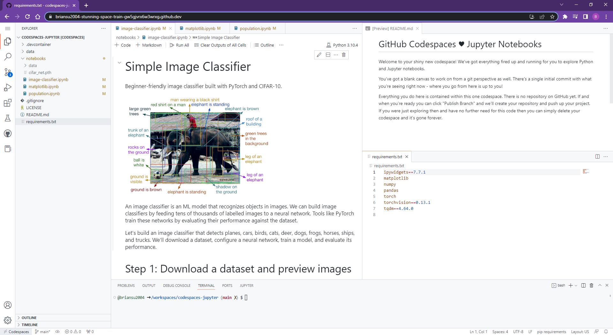
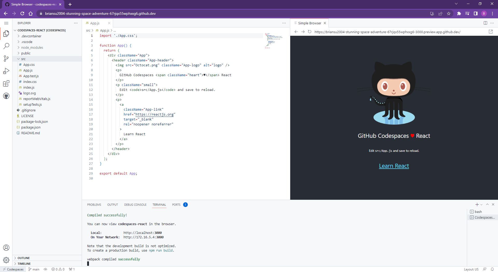
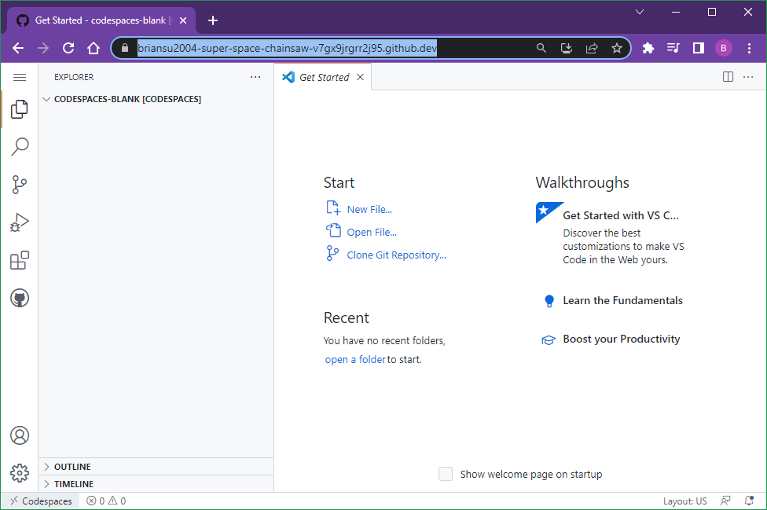
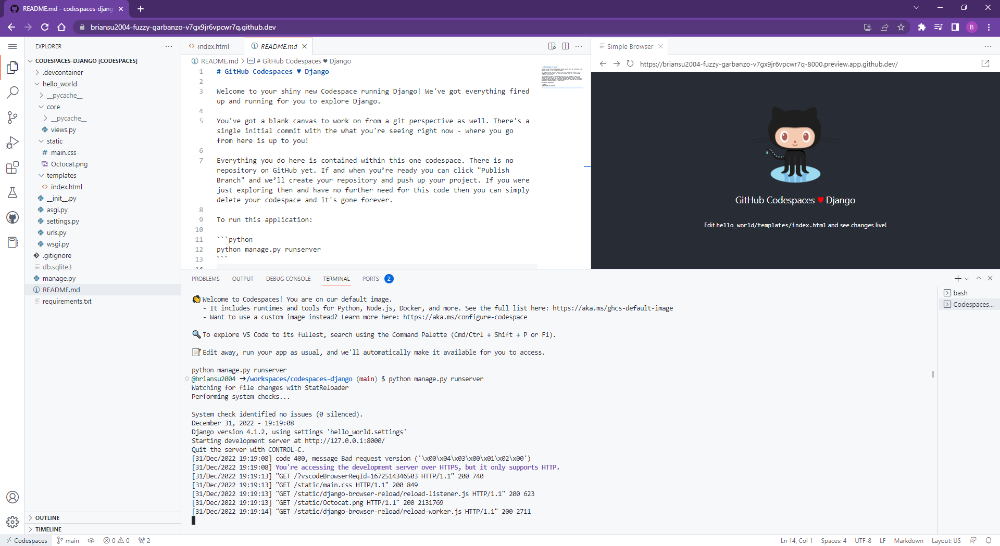
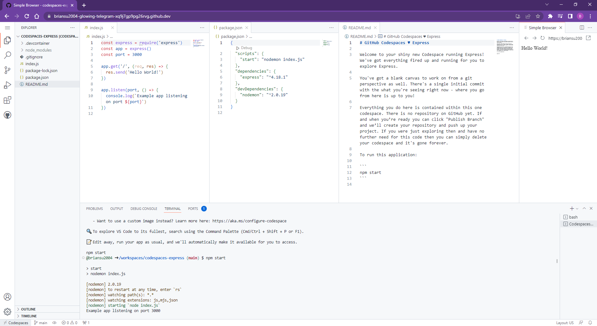
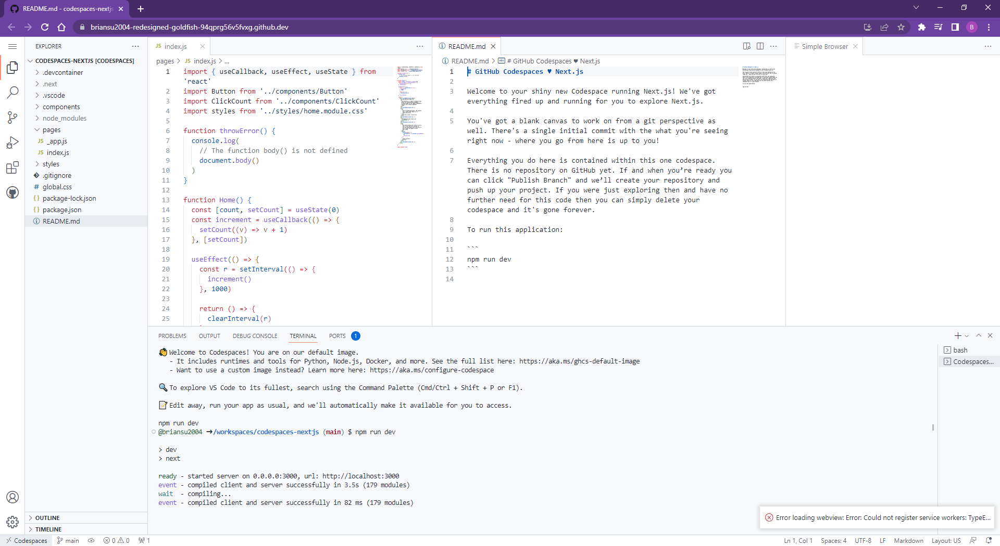
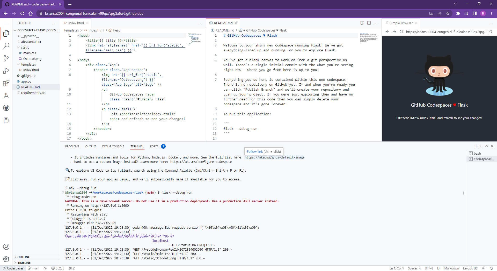
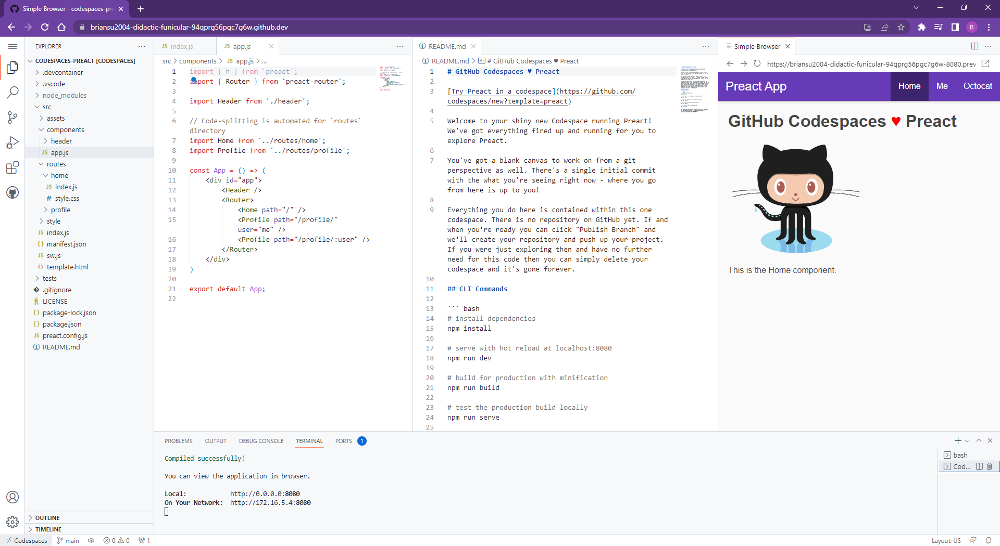
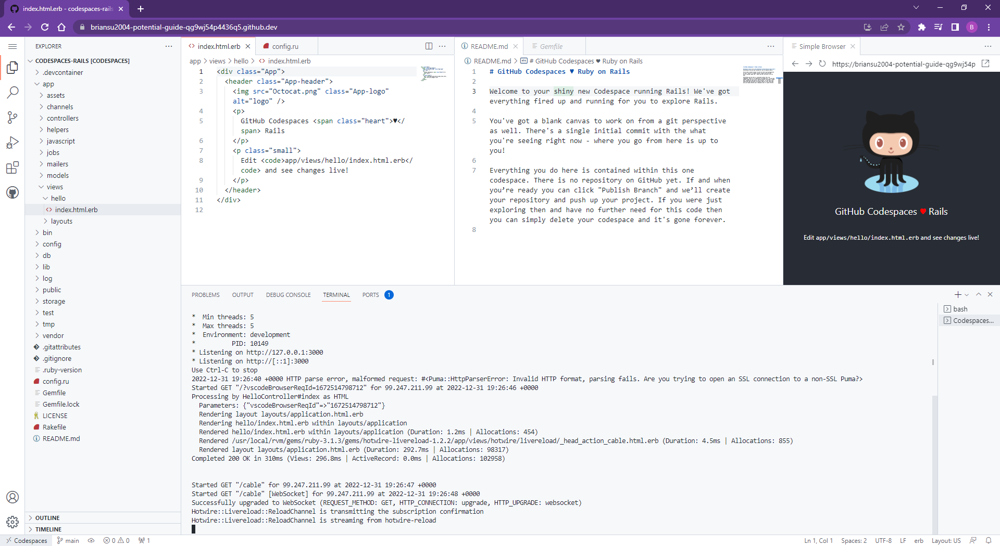

# My CodeSpace from templates

## My 1st Jupyter Notebook CodeSpace

<https://briansu2004-stunning-space-train-gw5gjvrx6w3wrxg.github.dev/>

## My 1st React Notebook CodeSpace

<https://briansu2004-stunning-space-adventure-67rjqx55wphxxg6.github.dev/>

## My 1st Blank CodeSpace

<https://briansu2004-super-space-chainsaw-v7gx9jrgrr2j95.github.dev/>

## My 1st Django CodeSpace

<https://briansu2004-fuzzy-garbanzo-v7gx9jr6vpcwr7q.github.dev/>

## My 1st Express CodeSpace

<https://briansu2004-glowing-telegram-xq9j7gp9pg26rvg.github.dev/>

## My 1st Next.js CodeSpace

<https://briansu2004-redesigned-goldfish-94qprg56v5fvxg.github.dev/>

## My 1st Flask CodeSpace

<https://briansu2004-congenial-funicular-v99qx7qrg3x6w6.github.dev/>

## My 1st Preact CodeSpace

<https://briansu2004-didactic-funicular-94qprg56pgc7g6w.github.dev/>

## My 1st Ruby on Rails CodeSpace

<https://briansu2004-potential-guide-qg9wj54p4436q5.github.dev/>

