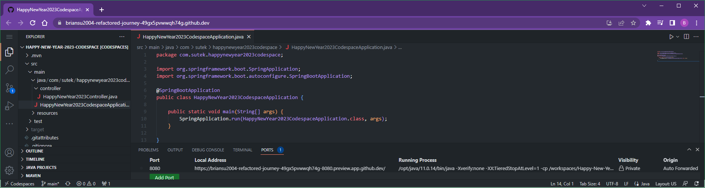

# MyGitHubCodeSpaces

My GitHub CodeSpaces

## My Spring Boot CodeSpace

### Happy New Year 2023

#### Local

com.sutek

happy-new-year-2023-codespace

Happy New Year 2023 CodeSpace


<http://localhost:8080/api/v1/happynewyear2023>


#### GitHub CodeSpace


<https://briansu2004-refactored-journey-49gx5pvwwqh74g.github.dev/>


Run with Maven

```bash
chmod 777 ./mvnw
./mvnw spring-boot:run
```


Port forwarding




```dos
https://briansu2004-refactored-journey-49gx5pvwwqh74g.github.dev/

->

https://briansu2004-refactored-journey-49gx5pvwwqh74g-8080.preview.app.github.dev/
```

`-8080.preview.app`

[Update the endpoint]

```dos
https://briansu2004-refactored-journey-49gx5pvwwqh74g.github.dev/api/happy/v1/happynewyear2023

->

https://briansu2004-refactored-journey-49gx5pvwwqh74g-8080.preview.app.github.dev/api/happy/v1/happynewyear2023
```


[Troubleshooting]

```dos
[INFO] ------------------------------------------------------------------------
[INFO] BUILD FAILURE
[INFO] ------------------------------------------------------------------------
[INFO] Total time:  6.183 s
[INFO] Finished at: 2022-12-31T20:16:27Z
[INFO] ------------------------------------------------------------------------
[ERROR] Failed to execute goal org.apache.maven.plugins:maven-compiler-plugin:3.10.1:compile (default-compile) on project happy-new-year-2023-codespace: Fatal error compiling: error: invalid target release: 17 -> [Help 1]
[ERROR] 
[ERROR] To see the full stack trace of the errors, re-run Maven with the -e switch.
[ERROR] Re-run Maven using the -X switch to enable full debug logging.
[ERROR] 
[ERROR] For more information about the errors and possible solutions, please read the following articles:
[ERROR] [Help 1] http://cwiki.apache.org/confluence/display/MAVEN/MojoExecutionException
```

```dos
@briansu2004 ➜ /workspaces/Happy-New-Year-2023-CodeSpace (main ✗) $ java -version
openjdk version "11.0.14.1" 2022-02-08 LTS
OpenJDK Runtime Environment Microsoft-31205 (build 11.0.14.1+1-LTS)
OpenJDK 64-Bit Server VM Microsoft-31205 (build 11.0.14.1+1-LTS, mixed mode)
```

```dos
@briansu2004 ➜ /workspaces/Happy-New-Year-2023-CodeSpace (main ✗) $ env
SHELL=/bin/bash
NUGET_XMLDOC_MODE=skip
COLORTERM=truecolor
CLOUDENV_ENVIRONMENT_ID=5c3b7fc4-a8d2-4248-b676-7378ba9e29e6
NVM_INC=/usr/local/share/nvm/versions/node/v16.18.1/include/node
TERM_PROGRAM_VERSION=1.74.2
GITHUB_USER=briansu2004
rvm_prefix=/usr/local
CODESPACE_NAME=briansu2004-crispy-invention-67rjqx55pw2p9r
HOSTNAME=codespaces-ffc03c
JAVA_ROOT=/home/codespace/java
JAVA_HOME=/usr/local/sdkman/candidates/java/current
DOTNET_ROOT=/usr/local/dotnet/current
CODESPACES=true
PYTHON_ROOT=/home/codespace/.python
GRADLE_HOME=/usr/local/sdkman/candidates/gradle/current
NVS_DIR=/usr/local/nvs
NVS_OS=linux
DOTNET_SKIP_FIRST_TIME_EXPERIENCE=1
MY_RUBY_HOME=/usr/local/rvm/rubies/ruby-3.1.3
NVS_USE_XZ=1
SDKMAN_CANDIDATES_DIR=/usr/local/sdkman/candidates
RUBY_VERSION=ruby-3.1.3
PWD=/workspaces/Happy-New-Year-2023-CodeSpace
PIPX_BIN_DIR=/usr/local/py-utils/bin
rvm_version=1.29.12 (latest)
ORYX_DIR=/usr/local/oryx
ContainerVersion=12
VSCODE_GIT_ASKPASS_NODE=/vscode/bin/linux-x64/e8a3071ea4344d9d48ef8a4df2c097372b0c5161/node
HUGO_ROOT=/home/codespace/.hugo
GITHUB_CODESPACES_PORT_FORWARDING_DOMAIN=preview.app.github.dev
NPM_GLOBAL=/home/codespace/.npm-global
HOME=/home/codespace
GITHUB_API_URL=https://api.github.com
LANG=en_US.UTF-8
GITHUB_TOKEN=
LS_COLORS=rs=0:di=01;34:ln=01;36:mh=00:pi=40;33:so=01;35:do=01;35:bd=40;33;01:cd=40;33;01:or=40;31;01:mi=00:su=37;41:sg=30;43:ca=30;41:tw=30;42:ow=34;42:st=37;44:ex=01;32:*.tar=01;31:*.tgz=01;31:*.arc=01;31:*.arj=01;31:*.taz=01;31:*.lha=01;31:*.lz4=01;31:*.lzh=01;31:*.lzma=01;31:*.tlz=01;31:*.txz=01;31:*.tzo=01;31:*.t7z=01;31:*.zip=01;31:*.z=01;31:*.dz=01;31:*.gz=01;31:*.lrz=01;31:*.lz=01;31:*.lzo=01;31:*.xz=01;31:*.zst=01;31:*.tzst=01;31:*.bz2=01;31:*.bz=01;31:*.tbz=01;31:*.tbz2=01;31:*.tz=01;31:*.deb=01;31:*.rpm=01;31:*.jar=01;31:*.war=01;31:*.ear=01;31:*.sar=01;31:*.rar=01;31:*.alz=01;31:*.ace=01;31:*.zoo=01;31:*.cpio=01;31:*.7z=01;31:*.rz=01;31:*.cab=01;31:*.wim=01;31:*.swm=01;31:*.dwm=01;31:*.esd=01;31:*.jpg=01;35:*.jpeg=01;35:*.mjpg=01;35:*.mjpeg=01;35:*.gif=01;35:*.bmp=01;35:*.pbm=01;35:*.pgm=01;35:*.ppm=01;35:*.tga=01;35:*.xbm=01;35:*.xpm=01;35:*.tif=01;35:*.tiff=01;35:*.png=01;35:*.svg=01;35:*.svgz=01;35:*.mng=01;35:*.pcx=01;35:*.mov=01;35:*.mpg=01;35:*.mpeg=01;35:*.m2v=01;35:*.mkv=01;35:*.webm=01;35:*.ogm=01;35:*.mp4=01;35:*.m4v=01;35:*.mp4v=01;35:*.vob=01;35:*.qt=01;35:*.nuv=01;35:*.wmv=01;35:*.asf=01;35:*.rm=01;35:*.rmvb=01;35:*.flc=01;35:*.avi=01;35:*.fli=01;35:*.flv=01;35:*.gl=01;35:*.dl=01;35:*.xcf=01;35:*.xwd=01;35:*.yuv=01;35:*.cgm=01;35:*.emf=01;35:*.ogv=01;35:*.ogx=01;35:*.aac=00;36:*.au=00;36:*.flac=00;36:*.m4a=00;36:*.mid=00;36:*.midi=00;36:*.mka=00;36:*.mp3=00;36:*.mpc=00;36:*.ogg=00;36:*.ra=00;36:*.wav=00;36:*.oga=00;36:*.opus=00;36:*.spx=00;36:*.xspf=00;36:
DYNAMIC_INSTALL_ROOT_DIR=/opt
NVM_SYMLINK_CURRENT=true
PHP_PATH=/usr/local/php/current
DEBIAN_FLAVOR=focal-scm
SDKMAN_VERSION=5.16.0
GIT_ASKPASS=/vscode/bin/linux-x64/e8a3071ea4344d9d48ef8a4df2c097372b0c5161/extensions/git/dist/askpass.sh
PHP_ROOT=/home/codespace/.php
ORYX_ENV_TYPE=vsonline-present
HUGO_DIR=/usr/local/hugo/bin
DOCKER_BUILDKIT=1
GOROOT=/usr/local/go
INTERNAL_VSCS_TARGET_URL=https://eastus.online.visualstudio.com
SHELL_LOGGED_IN=true
PYTHON_PATH=/usr/local/python/current
NVM_DIR=/usr/local/share/nvm
VSCODE_GIT_ASKPASS_EXTRA_ARGS=
rvm_bin_path=/usr/local/rvm/bin
GEM_PATH=/usr/local/rvm/gems/ruby-3.1.3:/usr/local/rvm/gems/ruby-3.1.3@global
GEM_HOME=/usr/local/rvm/gems/ruby-3.1.3
GITHUB_CODESPACE_TOKEN=
LESSCLOSE=/usr/bin/lesspipe %s %s
NVS_ROOT=/usr/local/nvs
GITHUB_GRAPHQL_URL=https://api.github.com/graphql
TERM=xterm-256color
LESSOPEN=| /usr/bin/lesspipe %s
USER=codespace
NODE_ROOT=/home/codespace/nvm
VSCODE_GIT_IPC_HANDLE=/tmp/vscode-git-fa25234d91.sock
PYTHONIOENCODING=UTF-8
GITHUB_SERVER_URL=https://github.com
NVS_HOME=/usr/local/nvs
PIPX_HOME=/usr/local/py-utils
CONDA_SCRIPT=/opt/conda/etc/profile.d/conda.sh
MAVEN_HOME=/usr/local/sdkman/candidates/maven/current
SDKMAN_DIR=/usr/local/sdkman
SHLVL=2
NVM_CD_FLAGS=
ORYX_SDK_STORAGE_BASE_URL=https://oryx-cdn.microsoft.io
GIT_EDITOR=code --wait
CONDA_DIR=/opt/conda
PROMPT_DIRTRIM=4
SDKMAN_CANDIDATES_API=https://api.sdkman.io/2
ENABLE_DYNAMIC_INSTALL=true
MAVEN_ROOT=/home/codespace/.maven
ORYX_PREFER_USER_INSTALLED_SDKS=true
JUPYTERLAB_PATH=/home/codespace/.local/bin
RVM_PATH=/usr/local/rvm
GITHUB_REPOSITORY=briansu2004/Happy-New-Year-2023-CodeSpace
RAILS_DEVELOPMENT_HOSTS=.githubpreview.dev,.app.github.dev
VSCODE_GIT_ASKPASS_MAIN=/vscode/bin/linux-x64/e8a3071ea4344d9d48ef8a4df2c097372b0c5161/extensions/git/dist/askpass-main.js
RUBY_ROOT=/home/codespace/.ruby
RUBY_HOME=/usr/local/rvm/rubies/default
BROWSER=/vscode/bin/linux-x64/e8a3071ea4344d9d48ef8a4df2c097372b0c5161/bin/helpers/browser.sh
PATH=/usr/local/rvm/gems/ruby-3.1.3/bin:/usr/local/rvm/gems/ruby-3.1.3@global/bin:/usr/local/rvm/rubies/ruby-3.1.3/bin:/vscode/bin/linux-x64/e8a3071ea4344d9d48ef8a4df2c097372b0c5161/bin/remote-cli:/home/codespace/.local/bin:/home/codespace/.dotnet:/home/codespace/nvm/current/bin:/home/codespace/.php/current/bin:/home/codespace/.python/current/bin:/home/codespace/java/current/bin:/home/codespace/.ruby/current/bin:/home/codespace/.local/bin:/usr/local/oryx:/usr/local/go/bin:/go/bin:/usr/local/sdkman/bin:/usr/local/sdkman/candidates/java/current/bin:/usr/local/sdkman/candidates/gradle/current/bin:/usr/local/sdkman/candidates/maven/current/bin:/usr/local/rvm/gems/default/bin:/usr/local/rvm/gems/default@global/bin:/usr/local/rvm/rubies/default/bin:/usr/local/share/rbenv/bin:/opt/conda/bin:/usr/local/php/current/bin:/usr/local/python/current/bin:/usr/local/py-utils/bin:/usr/local/nvs:/usr/local/share/nvm/versions/node/v16.18.1/bin:/usr/local/hugo/bin:/usr/local/dotnet/current:/usr/local/sbin:/usr/local/bin:/usr/sbin:/usr/bin:/sbin:/bin:/home/codespace/.dotnet/tools:/usr/local/rvm/bin
CODESPACE_VSCODE_FOLDER=/workspaces/Happy-New-Year-2023-CodeSpace
SDKMAN_PLATFORM=linuxx64
NVM_BIN=/usr/local/share/nvm/versions/node/v16.18.1/bin
IRBRC=/usr/local/rvm/rubies/ruby-3.1.3/.irbrc
VSCDC_FIXED_SECRETS=true
rvm_path=/usr/local/rvm
OLDPWD=/vscode/bin/linux-x64/e8a3071ea4344d9d48ef8a4df2c097372b0c5161
GOPATH=/go
TERM_PROGRAM=vscode
VSCODE_IPC_HOOK_CLI=/tmp/vscode-ipc-7b9eb75c-1c70-4ea4-aceb-ce828a9b7139.sock
_=/usr/bin/env
@briansu2004 ➜ /workspaces/Happy-New-Year-2023-CodeSpace (main ✗) $ 
```

Because CodeSpace uses JDK 11, have to change from 17 to 11, and can't use Spring Boot 3.

## My CodeSpace from templates

[My CodeSpace from templates](CodeSpacesFromTemplates.md)

## All of my CodeSpaces

<https://github.com/codespaces>

## Info

<https://github.com/features/codespaces>


